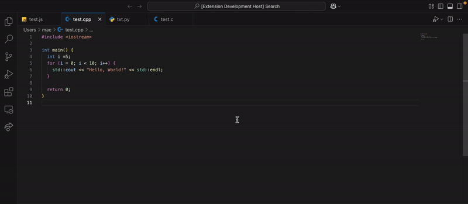

# BlackT Code Style

BlackT Code Style is a powerful VS Code extension designed to streamline your coding workflow by enforcing custom code styles in your project. Inspired by the `Style50` tool from CS50.dev, I wanted to create a similar tool that could be used locally in VS Code. With BlackT Code Style, you can easily apply a predefined set of coding standards, ensuring consistent and clean code across your development environment.

Not only does it help in maintaining coding standards, but it also serves as a great tool for getting into the habit of formatting code properly. By comparing the original code with the formatted version, users can easily spot and fix mistakes, improving their coding habits over time.



## Features

- **Apply Custom Coding Standards**: Automatically format your code by applying a combination of Prettier, Clang, and Black formatting rules, ensuring consistent and clean code across multiple languages (Python, JavaScript, Java, C, C++, etc.).
- **Terminal Support**: Apply the custom formatting directly from the terminal using the `codestyle` command on any supported file.
- **Split Editor View**: After applying the style, view your code with the applied changes side-by-side with the original file in a split editor layout.
- **Supports Multiple File Types**: Works seamlessly with various languages, including `.py`, `.js`, `.java`, `.c`, `.cpp`, and more.

## Requirements

Before using the BlackT Code Style extension, make sure you have the following installed:

1. **Prettier**: Automatically formats code in a wide range of languages.
    - Install Prettier globally or locally:
    ```bash
    npm install -g prettier
    ```

2. **Clang**: Used for C and C++ code formatting.
    - Install Clang:
    ```bash
    brew install clang-format
    ```

3. **Black**: A code formatter for Python.
    - Install Black:
    ```bash
    pip install black
    ```

4. **VS Code**: This extension requires Visual Studio Code to work properly.

## How to Use

You can apply the custom code style using either the **Command Palette** in VS Code or the **Terminal**:

### Method 1: Use the Command Palette
1. Open the Command Palette:
    - Press `Ctrl+Shift+P` (Windows/Linux) or `Cmd+Shift+P` (Mac) to open the Command Palette in VS Code.

2. Run the `Apply Code Style` Command:
    - Type and select the `Apply Code Style` command from the palette. This will format your code according to predefined rules, such as proper indentation, space management, and consistent coding conventions.

3. View Changes:
    - After running the command, the original code will be displayed on the left, and the formatted code will appear on the right side of the editor in a split view.

4. See Errors:
    - You can see the errors in your code format in red, and the right way to do it in green in the `codestyle` file. Once you correct something, the highlight will disappear, and you can move on to fix other issues.

5. Automatic Closure:
    - When everything is fixed, the `codestyle` file will close automatically.

### Method 2: Use the Terminal
1. Open your terminal in VS Code.

2. Run the `codestyle` Command:
    - Type the following command in the terminal:
    ```bash
    codestyle <file-path>
    ```
    - For example, to format a Python file, run:
    ```bash
    codestyle file.py
    ```
    - This command will apply the custom formatting to the specified file.

3. View Changes:
    - The formatted code will be displayed side-by-side with the original code in a split editor view.

4. See Errors:
    - You can see the errors in your code format in red, and the right way to do it in green in the `codestyle` file. Once you correct something, the highlight will disappear, and you can move on to fix other issues.

5. Automatic Closure:
    - When everything is fixed, the `codestyle` file will close automatically.

### Customizing Code Style Preferences

At the top of the `formatter.js` file, you'll find a configuration block that defines the default styles for different programming languages:

```javascript
// Global variable to store user-selected styles with defaults for each language
const STYLES = {
    C: 'microsoft',   // C files: Microsoft style (brace on the next line)
    PYTHON: 'microsoft', // Python files: Microsoft style (brace on the next line)
    JAVA: 'google',    // Java files: Google style (brace on the same line)
    JAVASCRIPT: 'llvm',        // JavaScript files: LLVM style
    CPP: 'google',  // C++ files: Google style (brace on the same line)
};
```

You can customize these values to match your preferred code styles. Once you modify this block, the generated formatted code will follow your selected styles for each language.

## Installation

### Install from VS Code Marketplace
1. Open the Extensions view by clicking on the Extensions icon in the Activity Bar on the side of the window.
2. Search for `BlackT Code Style` in the Marketplace.
3. Click on the **Install** button to add the extension to your VS Code setup.

### Package Locally
If you prefer to install the extension locally:
1. Download the repository and navigate to the folder containing the extension's code.
2. Open a terminal and run `npm install` to install the necessary dependencies.
3. Run `vsce package` to package the extension into a `.vsix` file.
4. In VS Code, open the Command Palette and select `Extensions: Install from VSIX...`.
5. Choose the `.vsix` file you created to install the extension locally.

## License

This project is licensed under the MIT License. See the [LICENSE](LICENSE) file for more details.

---

## Contributing

If you'd like to contribute to the project, feel free to fork the repository, create a new branch, and submit a pull request. Contributions are always welcome!

### To contribute:
- Clone the repository: `git clone https://github.com/bla999ckt/blackt-codestyle.git`
- Install dependencies: `npm install`
- Build the extension: `npm run build`
- Test your changes locally by launching VS Code with your extension: `F5`
- Submit a pull request with a detailed description of your changes.

## Acknowledgements

Thank you to the open-source community for your contributions, and to the users of BlackT Code Style for providing feedback that helps improve the extension!
